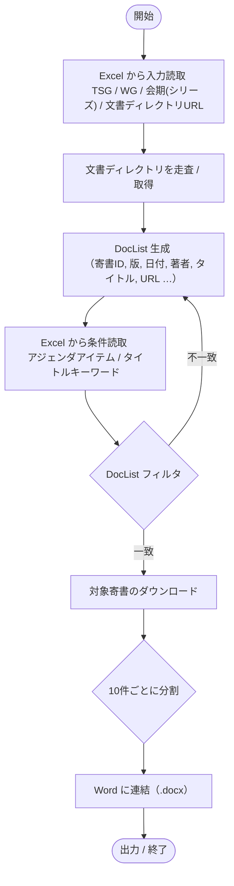
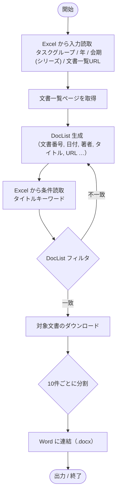

# get_3gpp_and_ieee

# How To CLONE

```
git clone https://github.com/tmusimesabaoi4i/get_3gpp_and_ieee.git
```

# How To PUSH

```
git add ./
```

and

```
git commit --allow-empty -m "　"
```

and

```
git push
```

# 入力エクセル（例）

## 3gpp
### ① 日本語ラベル
| 行 | A列（ラベル）       | B列                                                                 |
|---:|----------------------|----------------------------------------------------------------------|
|  1 | 日付                 | 20251018                                                             |
|  2 | 案件番号             | 特願20XX-XXXXXX                                                       |
|  3 | TSG                  | tsg_ran                                                              |
|  4 | 作業部会(WG)         | WG2_RL2                                                              |
|  5 | 会期/会合(シリーズ)  | TSGR2_105bis                                                         |
|  6 | 文書ディレクトリURL  | https://www.3gpp.org/ftp/tsg_ran/WG2_RL2/TSGR2_105bis/Docs          |

### ② 変数名（snake_case）
| 行 | A列（変数名） | B列                                                                 |
|---:|----------------------|----------------------------------------------------------------------|
|  1 | date                 | 20251018                                                             |
|  2 | case_id              | 特願20XX-XXXXXX                                                       |
|  3 | tsg                  | tsg_ran                                                              |
|  4 | wg                   | WG2_RL2                                                              |
|  5 | series               | TSGR2_105bis                                                         |
|  6 | docs_url             | https://www.3gpp.org/ftp/tsg_ran/WG2_RL2/TSGR2_105bis/Docs          |

## IEEE
### ① 日本語ラベル
| 行 | A列（ラベル） | B列                                                                                               |
|---:|----------------|--------------------------------------------------------------------------------------------------|
|  1 | 日付           | 20251018                                                                                         |
|  2 | 案件番号       | 特願20XX-XXXXXX                                                                                  |
|  3 | タスクグループ | be                                                                                               |
|  4 | 年             | 2024                                                                                             |
|  5 | 文書一覧URL    | https://mentor.ieee.org/802.11/documents?n=1&o=7d&is_group=00be&is_year=2024                          |

### ② 変数名（snake_case）
| 行 | A列（変数名） | B列                                                                                               |
|---:|----------------|----------------------------------------------------------------------------------------------------|
|  1 | date           | 20251018                                                                                           |
|  2 | case_id        | 特願20XX-XXXXXX                                                                                  |
|  3 | task_group     | be                                                                                                 |
|  4 | year           | 2024                                                                                               |
|  5 | docs_url       | https://mentor.ieee.org/802.11/documents?n=1&o=7d&is_group=00be&is_year=2024                          |

# DocList
DocListはドキュメントを整理した関数です。

### 3GPP
| URL | 著者 | タイトル | 日付 | 文献番号 | アジェンダアイテム |
|---|---|---|---|---|---|
| [R2-1903000.zip](http://www.3gpp.org/ftp/TSG_RAN/WG2_RL2/TSGR2_105bis/Docs/R2-1903000.zip) | Chairman | Agenda for RAN2#105bis | 2019/3/29 13:55 | R2-1903000 | 2.1 |

### IEEE
| URL | 著者 | タイトル | 日付 | 文献番号 | バージョン |
|---|---|---|---|---|---|
| [11-24-1412-02-00be-tgbe-july-september-teleconference-minutes.docx](https://mentor.ieee.org/802.11/dcn/24/11-24-1412-02-00be-tgbe-july-september-teleconference-minutes.docx) | Jason Yuchen Guo (Huawei) | TGbe July September Teleconference Minutes | 10-Sep-24 | 1412 | 2 |

# 処理フロー

```mermaid
flowchart TB
    A([開始]) --> B{対象の標準化団体}
    B -->|3GPP| C3GPP["Excel 読取\nTSG / WG / 会期(シリーズ) / 文書ディレクトリURL]
    B -->|IEEE| CIEEE["Excel 読取\nタスクグループ / 年 / 会期(シリーズ) / 文書一覧URL]

    C3GPP --> D3GPP[DocList 生成\n寄書リスト化]
    CIEEE --> DIEEE[DocList 生成\n寄書リスト化]

    D3GPP --> E3GPP["Excel 読取（条件）\nアジェンダアイテム / タイトルキーワード"]
    DIEEE --> EIEEE["Excel 読取（条件）\nタイトルキーワード"]

    E3GPP --> F[条件に合致する寄書をダウンロード]
    EIEEE --> F

    F --> G[10件ごとに Word へ連結（.docx バンドル）]
    G --> H([成果物出力 / 終了])

```





# How To USE

このツールは **Python スクリプトとして実行**しても、**単一 .exe** にビルドして実行しても使えます。  
ここでは両方のやり方と、.exe の作り方（PyInstaller）をまとめます。

---

## 1) Python で実行

### ヘルプ
```bash
python main.py --help
```

### 例：プロキシ分析は既定で有効
```bash
python main.py --drive C --db ieee --excel C:\Users\yohei\Downloads\ieee_input.xlsx
```

### 例：ログ冗長度（INFO）
```bash
python main.py --drive C --db ieee --excel C:\Users\yohei\Downloads\ieee_input.xlsx -v
```

### 例：ログ冗長度（DEBUG）
```bash
python main.py --drive C --db ieee --excel C:\Users\yohei\Downloads\ieee_input.xlsx -vv
```

### 例：プロキシ分析を無効化（Python 3.9+）
```bash
python main.py --drive C --db 3gpp --excel C:\work\in.xlsx --no-proxy-analysis
```

### 例：旧Python（3.8 など）
```bash
python main.py --drive C --db 3gpp --excel C:\work\in.xlsx --proxy-analysis off
```

> **必須引数**：`--drive`（ドライブレター）, `--db`（`ieee`/`3gpp`）, `--excel`（Excel の**絶対パス**）  
> **オプション**：`--no-proxy-analysis` または `--proxy-analysis off`（既定は有効）  
> **ログ**：`-v`（INFO）, `-vv`（DEBUG） / `--help` で全一覧表示

---

## 2) .exe で実行（配布・配信用）

ビルド済みの `mytool.exe` がある前提での実行例です。  
コマンドライン・オプションは **Python 実行時と同じ**です。

### ヘルプ
```bash
mytool.exe --help
```

### 例：プロキシ分析は既定で有効
```bash
mytool.exe --drive C --db ieee --excel C:\Users\yohei\Downloads\ieee_input.xlsx
```

### 例：ログ冗長度
```bash
mytool.exe --drive C --db ieee --excel C:\Users\yohei\Downloads\ieee_input.xlsx -vv
```

### 例：プロキシ分析を無効化
```bash
mytool.exe --drive C --db 3gpp --excel C:\work\in.xlsx --no-proxy-analysis
```

#### ダブルクリック運用したい場合（バッチ例）
```bat
@echo off
"%~dp0mytool.exe" --drive C --db ieee --excel C:\Users\yohei\Downloads\ieee_input.xlsx -vv --log-file "%~dp0mytool.log"
pause
```

> コンソール非表示ビルド（`-w`）だと標準出力が見えません。ログは `--log-file` を併用してください。

---

## 3) .exe の作り方（PyInstaller）

### セットアップ
```bash
python -m venv .venv
.venv\Scripts\activate
pip install -U pip
pip install pyinstaller
# （必要に応じて）requests, pywin32 など依存を追加
pip install requests pywin32
```

### 単一ファイル .exe をビルド
```bash
pyinstaller -F --paths . -n mytool main.py
```
- 出力: `dist\mytool.exe`
- `--paths .` はプロジェクト直下のパッケージ（例：`emoji/`, `pure_download/`）を見せるための検索パス追加
- `pywin32`（`win32com` を使う場合）は自動同梱されます。環境によっては保険として以下を足すと安定します：
  ```bash
  pyinstaller -F --paths . -n mytool --hidden-import win32timezone main.py
  ```

### コンソールを出さない（GUI/バックグラウンド）
```bash
pyinstaller -F -w --paths . -n mytool main.py
```
- コンソールが出ない代わりに、**ログ出力は `--log-file` を必ず指定**してください。

---

## トラブルシューティング

- **「モジュールが見つからない」**  
  → `--paths .` を付けて再ビルド。インポートは**絶対インポート**（例：`from emoji.emoscript import emo`）に。

- **pywin32 周りのエラー**  
  → `pip install pywin32` 済みか確認。`--hidden-import win32timezone` を付けて再ビルド。

- **HTTPS 証明書エラー**  
  → `pip install certifi` を確認。プロキシ環境なら OS/社内ルート証明書設定も要確認。

---

## 仕様の要点（再掲）

- **必須**：`--drive` / `--db`（`ieee` or `3gpp`）/ `--excel`（絶対パスの Excel）  
- **プロキシ分析**：既定 **有効**。無効化は `--no-proxy-analysis`（旧Pythonは `--proxy-analysis off`）  
- **ログ**：`-v`（INFO）, `-vv`（DEBUG）、必要なら `--log-file` でファイル保存
